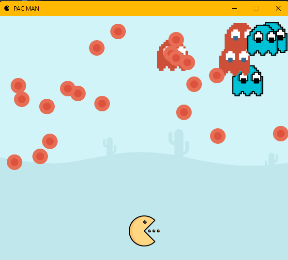

# Pac-Man-Inspired Game

**Pac-Man-Inspired Game** is an arcade-style game inspired by the classic Pac-Man. In this game, you control Pac-Man as it navigates a maze, collecting red food items while avoiding ghosts.

## Gameplay

- **Objective**: Guide Pac-Man through the screen, collect all the red food items, and avoid colliding with the ghosts.

- **Controls**:
  - Use the arrow keys (Up, Down, Left, Right) to control Pac-Man's movement.
  - Navigate Pac-Man through the screen, collecting all the red food items.
  - Avoid colliding with the ghosts.

- **Winning**: The game continues until you successfully collect all the red food items without colliding with any ghosts.

## How to Run

1. Make sure you have Python and the Pygame library installed.

2. Clone this repository to your local machine.

3. Run the game by executing the `pacman.py` script.

## Customization

You can customize the game by modifying various parameters in the `pacman.py` script:

- Adjust the game window's size by changing `screen_x` and `screen_y`.

- Customize the appearance of Pac-Man, ghosts, maze, and the red food items by replacing the image files.

- Modify game rules, such as the maze layout, ghost behavior, and difficulty level.

## Dependencies

- Python 3.x
- Pygame

